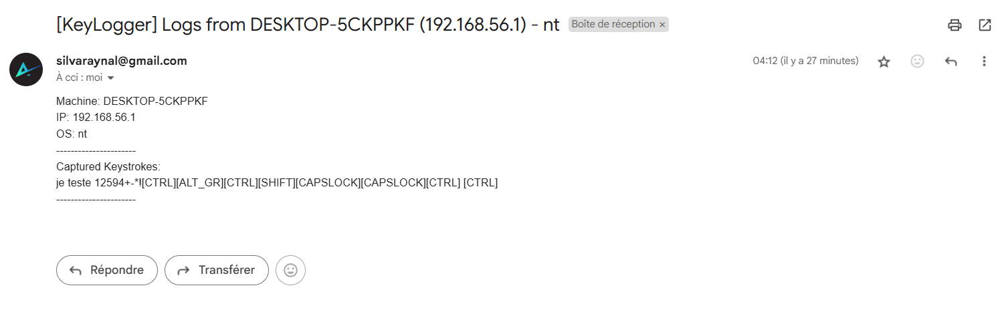

# 🦉 KeyLogger

🚨 **Ethical Use Only!** 🚨
This keylogger is developed for educational and cybersecurity awareness purposes. Unauthorized use on any system without explicit consent is illegal.

---

## 📌 **Overview**
This is a **lightweight keylogger** that logs keystrokes and sends them via email. It includes:
✅ **Background Execution**  
✅ **Timestamps for Each Minute**  
✅ **Machine Info in Logs**  
✅ **Secure Config Management**  

---

## 📸 **Email Logs**


---

## ⚙️ **Installation**

### 1️⃣ Clone the Repository
```bash
git clone https://github.com/PhasmeHargneux/KeyLogger.git
cd KeyLogger
```

### 2️⃣ Install Dependencies
```bash
pip install -r requirements.txt
```

### 3️⃣ Configure `conf.ini`
Edit `conf.ini` with your SMTP settings and preferences.

### 4️⃣ Run the KeyLogger
```bash
python keylogger.py
```

---

## ⚡ **Features**
- 🎯 **Stealth Mode** (Runs in the background)
- 🕒 **Logs keystrokes with timestamps**
- 📧 **Sends logs via email**
- 🖥 **Includes machine details (IP, hostname, OS)**

---

## 🛡️ **Legal Disclaimer**
This tool is intended for educational purposes only. The developer is not responsible for any misuse.

🚀 **Happy Hacking!**
